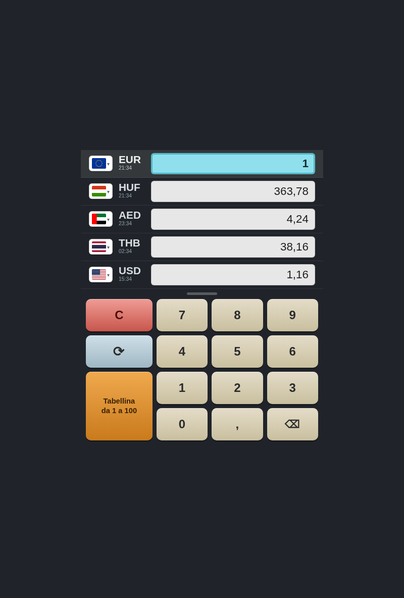

# Cambio Valute

🔗 **App live:** [paolobia.github.io/Currency](https://paolobia.github.io/Currency/)

Convertitore di valute in tempo reale, pensato per l'uso da smartphone: 5 righe di valuta convertibili tra loro all'istante, tastierino numerico stile calcolatrice, tabellina di conversione 1-100, selettore valuta con ricerca (150+ valute, bandiera reale per ciascuna), ora locale e meteo del giorno per ogni valuta.

App **Blazor WebAssembly (.NET 8)**, 100% client-side — nessun backend, installabile come **PWA** su Android, iOS e desktop.



## Funzionalità

- 5 righe di valuta, tutte ricalcolate automaticamente quando si digita in una di esse.
- Ora locale (formato 24h) del paese di riferimento sotto ogni codice valuta, aggiornata in tempo reale.
- Meteo del giorno (icona + temperatura minima/massima) della capitale del paese di riferimento di ogni valuta, da [Open-Meteo](https://open-meteo.com).
- Tassi di cambio da [open.er-api.com](https://open.er-api.com) (base USD), aggiornabili col tasto ⟳.
- Funziona offline con l'ultimo tasso scaricato (salvato in `localStorage`).
- Tabellina di conversione 1-100, a due colonne fluide, con i multipli di 10 evidenziati.
- Selettore valuta con ricerca per codice o nome, bandiera SVG per ogni valuta (nessuna dipendenza da emoji di sistema — compatibile con qualunque Android).

## Eseguire in locale

Richiede [.NET 8 SDK](https://dotnet.microsoft.com/download/dotnet/8.0).

```bash
dotnet run --urls http://0.0.0.0:5289
```

Apri `http://localhost:5289` nel browser (o l'IP della macchina sulla rete locale per provarla da telefono).

## Installarla come PWA (app sullo smartphone)

Basta aprire [l'URL live](https://paolobia.github.io/Currency/) da Chrome su Android (o Safari su iOS) e:

1. Menu del browser → **"Aggiungi a schermata Home"** / **"Installa app"**.
2. L'icona compare come una vera app: si apre a schermo intero, senza barra degli indirizzi.
3. Funziona anche offline (grazie al service worker che mette in cache l'app e l'ultimo tasso di cambio noto).

Puoi provarla come PWA anche in locale: avvia `dotnet publish -c Release -o publish`, servi la cartella `publish/wwwroot` con un qualsiasi web server statico (es. `dotnet tool install -g dotnet-serve` poi `dotnet-serve -d publish/wwwroot`) e apri l'URL da Chrome — solo la build **Release/pubblicata** attiva il service worker con cache offline, quella di `dotnet run` in sviluppo no (di proposito, per non dover invalidare la cache ad ogni modifica).

## Struttura del progetto

Vedi [CLAUDE.md](CLAUDE.md) per una panoramica dell'architettura (servizi, componenti, modelli) e delle decisioni prese durante lo sviluppo.

## Licenza bandiere

Le icone delle bandiere (`wwwroot/flags/`) provengono dal pacchetto open source [flag-icons](https://github.com/lipis/flag-icons) (licenza MIT).
